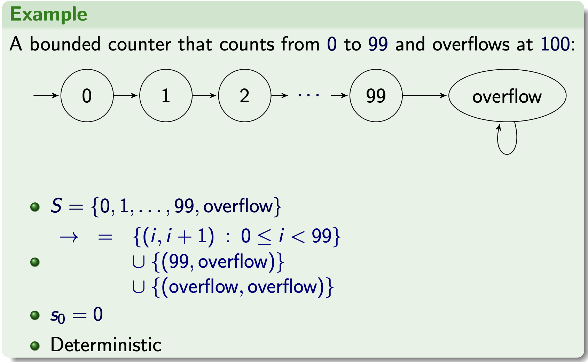

# Transition Systems

## Motivation

### Problems with relational modelling
* Relational modelling is useful but does not always capture everything that we care about
* Consider the two programs
    ```c
    void incr() {
        x := x + 1;
    }
    ```

    ```c
    void incr() {
        if (Math.random() < .5) then abort else 
            x := x + 1;
    }
    ```
    which can both be modelled by this relation over $\mathbb{Z} \times \mathbb{Z}$

    $${(x, x') : x + 1 = x'}$$

    but in the case with the second model, the relation does not capture the behaviour of the crashing state which can occur in the second program.
* Sometimes the final state is not what makes a program interesting.
    ```c
    void yes() {
        while(true) print("y");
    }
    ```
    As this program does not terminate, the relational model is just the empty set which does not say much

### State Machines
* State machines model step-by-step processes with:
    * A set of states, possibily including a designated start state.
    * A transition relation, detailing how to move (transition) from on state to another

* Example: The semantics of a program
    * States: functions from variable name to values
    * Transitions: execute a line of code

## Definitions

### Definitions for a transition system
* A transition system is a pair of $(S, \rightarrow)$ where:
    * $S$ is a set (of states), and
    * $\rightarrow \: \subseteq \: S \times S$ is a (transition) relation
    If $(s, s') \; \in \; \rightarrow$ we write $s \rightarrow s'$ 
    * $S$ may have a designated start state, $s_0 \: \in \:S$
    * $S$ may have a designated final state, $F \subseteq S$
    * The transitions may be labbelled by elements of a set $L$:
        * $\rightarrow \: \subseteq \: S \times L \times S$ 
        * $(s, a, s') \in \; \rightarrow \;$ is written as $\xrightarrow[]{\text{a}}$

    * If $\rightarrow$ is a partial function we say that the system is deterministic, otherwise it is non-deterministic

* Example: Bounded counter



### Runs and reachability
* Given a transition system $(S, \rightarrow)$ and states, $s, s' \in S$
    * a run (or trace) from s is a (possibly infinite) sequence $s_1, s_2, ....$ such that $s = s_1$ and $s_i \rightarrow s_{i+1}$ for all $i \ge 1$
    * A run is maximal if it cannot be extended
        * i.e. It is either infinite, or ends in a state from which there are no transitions
    * we say $s'$ is reachable from $s$, written $s \xrightarrow[]{\text{*}} s'$, if $(s, s')$ is in the reflexive and transitive closure of $\rightarrow$

### Safety and Liveness
* Transition systems can be used to study whether systems satisfy safety and liveness properties
* **Safety:** something bad will never happen
* **Liveness:** something good will happen
* Contrasting these two definitions with reachability which is something good can happen

## The Invariant Principle

### Proving a Safety Property
* To prove a safety property of the form "I will never reach the bad states"
* We need to find a property $\phi$ charaterising (possibly overapproximating) the reachable states
* Show that the bad states does not satisfy $\phi$
* Show that $\phi$ is preserved by the transition relation
    $$\text{If} \; \; \phi (s') \; \; \text{and} \; s\rightarrow s' \; \text{then} \; \phi (s')$$
* This property $\phi$ is called an invariant
* The Invariant Principle: If a preserved invariant hold at a state $s$ then, it holds for all states reachable from $s$

## Partial correctness and termination

### Partial Correctness
Let $(S, \rightarrow, s_0, F)$ be a transition system with start state $s_0$ and final states $F$ and a $\phi$ be a unary predicate on $S$. We say the system is partially correct for $\phi$ if $\phi(s')$ holds for all states $s' \in F$ that are reachable from $s_0$

### Measure
In a transition system $(S, \rightarrow)$, a measure is a function $f: S \rightarrow \mathbb{N}$. 

A measure is strictly decreasing if $s \rightarrow s'$ implies $f(s') < f(s)$

Theorem: If $f$ is a strictly decreasing measure, then the length of any run from $s$ is at not $f(s)$.


