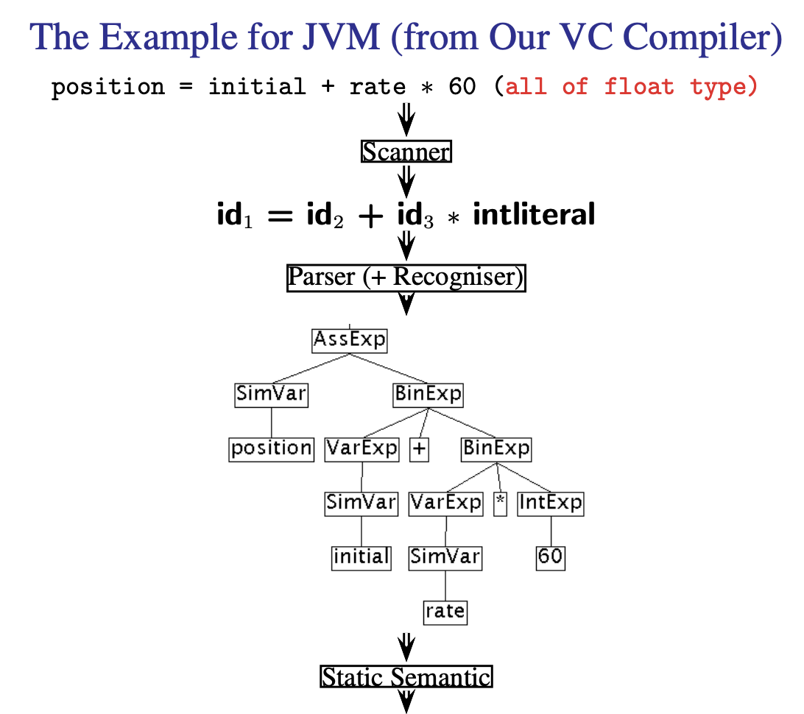

# Introductions and Lexical Analysis

## What is a Compiler

* Recognise **legal** (and **illegal**) programs
* Generate **correct**, hopefully **efficient**, code

### Typical Structure of a Compiler
* Has a Front-end and a Back-end
* COMP3131 will only focus on the Front-end
    * **Scanner** (Assignment 1) -> **Tokens**
    * **Parser** (Assignment 2 & 3) -> **AST**
    * **Semantic** Analyser (Assignment 4) -> **Decorated AST**
    * **Code Generator** (Assignment 5) -> **Jasmin code**




### Lexical Analysis

#### Scanner
* Groups character into **tokens** - the basic unit of syntax
    ```position = initial + rate * 60```
    becomes
    ```
    1. The identifier position
    2. The assignment operator = 
    3. The identifier initial
    4. The plus sign
    5. The identifier rate
    6. The multiplication sign
    7. The integer constant 60.
    ```
* Character string forming a token is a **lexeme**
* Eliminates white spaces (blanks, tabs and returns) and comments as they are only useful for the programmer and not the rest of the compiler modules

### Syntax Analsis

#### Parser

* Groups tokens into **grammatical phrases**
* Represents grammatical phases as an **Abstract Syntax Tree**
* Produces meaningful **error messages**
* Attempts **error detection** and **recovery**
* The syntax of a language is typically specified by a **CFG** (Context-Free-Grammar)

### Semantic Analysis

#### Semantic Analyser

* Checks the program for **semantics errors**
    * variable **used before defined**
    * operands called with **incompatible types**
    * procedures called with **incorrect number and types of arguments**
* An important task for the Semantic Analyser is to perform **type checking**
    * For example a real cannot be used to index into an array
    * Allow type conversions when some operand coercions are permitted
        * 2.0 to 2 (Real to Integer)

### Intermediate Code Generation

#### (Intermediate) Code Generator
* Used to generate an explicit **Intermediate Representation**
    * We used **Abstract Syntax Tree** representation in COMP3131
* Important **IR** properties
    * ease of generation
    * ease of translation into machine instructions
* Small decisions in the **IR design** may have **major effects on the speed and effectiveness** of the compiler
* Some popular IRs are ...
    * **ASTs**
    * **DAGs**
    * **Postfix Notation**
    * **Thress Address Code**

### Error Detection, Reporting and Recovery
* **Detection:**
    * **Lexical errors** - Incorrect spelling of a Word/Token
        * e.g. `"123` is an unterminated string
    * **Syntax errors** - Grammatical errors
        * e.g. `(2 * 3` has the correct spelling of tokens but does not make grammatical sense as it is missing a closing parenthesis
    * **Semantic errors** - Does not make logical sense
        * e.g. `1 + "hello"` is grammatically correct but does not make logical sense as you cannot add a number to a string
* **Report** the location where the error occured
* After detecting an error, if the error is not **fatal**, **recover** from it and proceed in order to further detect errors in the source program

## Lexical Analysis

### The role of a scanner
* The **tokens** to programming languages are what **words** are to natural languages
* The **scanner** operates as a **subroutine** called by the **parser** when it needs a new token in the **input stream**
* The **scanner** outputs **tokens** which are used by the **parser** to generate an **Abstract Syntax Tree**
* If there are any **lexical errors** detect, it is the **scanner's role**  to report them

### Tokens
* The tokens in VC are classified as follows:
    * idenifiers (e.g. `sum`, `i`, `j`)
    * keywords (e.g. `int`, `if`, `while`)
    * operators (e.g. `+`, `*`, `<=`)
    * separators (e.g. `{`, `}`, `;`)
    * literals (Integer, Real, Boolean and String constants)
* The token set depends on the programming language 
    * e.g. function declaration in Rust is `fn` whereas Kotlin uses `fun`
* Types of tokens also depends on the programming language in question

### Lexemes 
* The lexeme of a token is the character sequence forming the token
* Examples:
    * Token: `rate_1`, Token Type: `ID`, Lexeme: `rate_1`
    * Token: `true`, Token Type: `BOOLEANLITERAL`, Lexeme: `true`

### Patterns
* The **pattern** is a rule describing the set of lexemes that can represent a particular token
* The pattern is said to **match** each string in the set
* Need a formal notation for tokens
    * e.g. `1.0`, `.1`, `1.1e2` are all valid floats but all need a different pattern


### Finite State Machines for Integers and Reals
