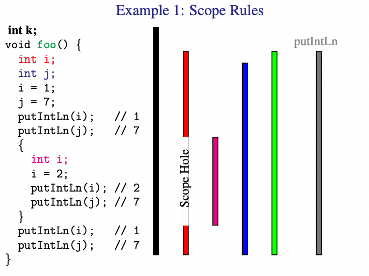
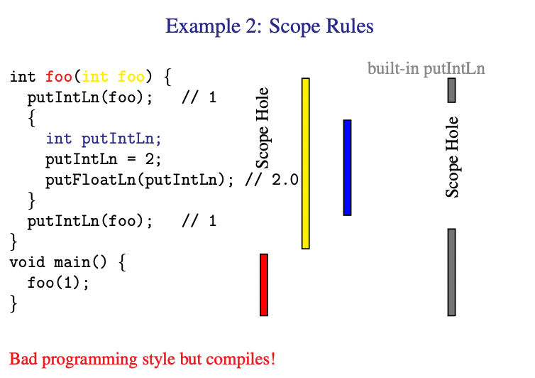
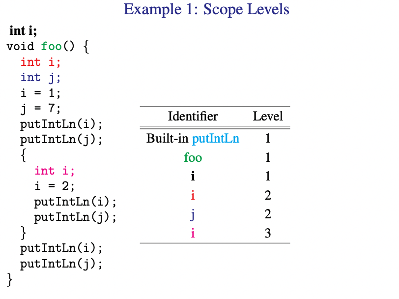
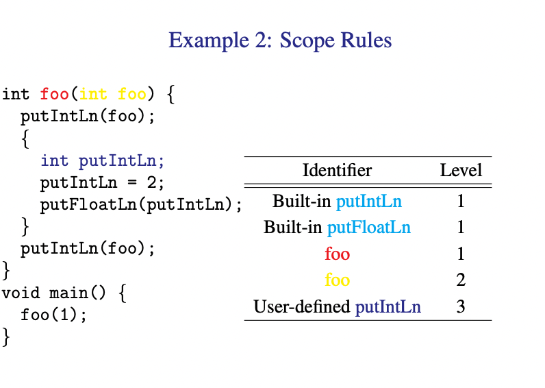
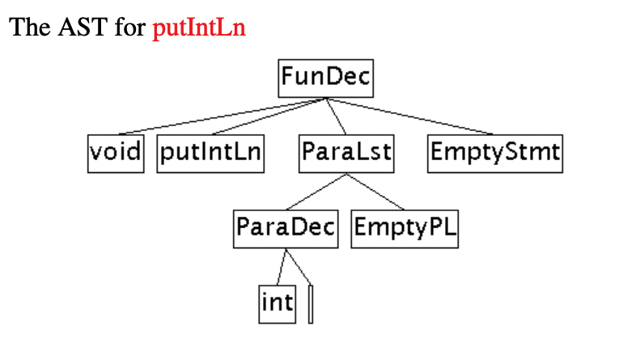
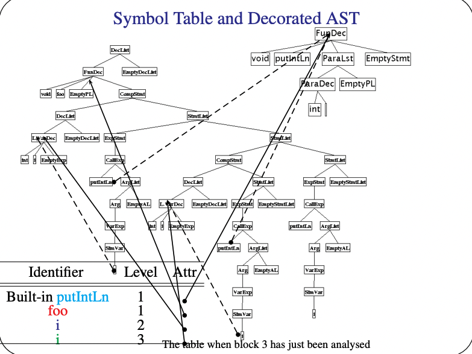
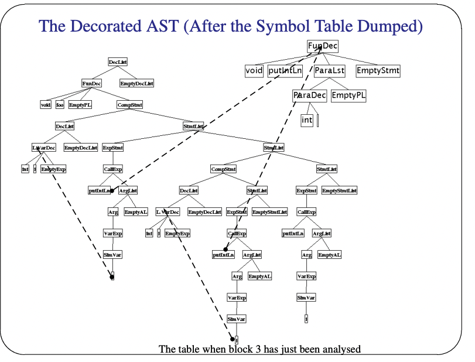

# Static Semantics

## Static Semantics
* Is x variable, method, array, class or package?
* Is x declared before used?
* Which declaration of x does this reference?
* Is an expression type-consistent?
* Does the dimension of an array match with the declaration?
* Is an array reference in bounds?
* Is a method called with the right number and types of arguments?
* Is break or continue enclosed in a loop construct?
* And many more similar questions?

**None of these questions can be specified using a Context Free Grammar!**

## Static Semantics: Scope Rules
### Blocks
* **Block:** a language construct that can contain declarations:
    * the compilation units (i.e. the code files)
    * procedures/functions (or methods)
    * compound statements
* There are two kinds of blocks in VC:
    * The entire program as one block
    * Compound Statements `{...} `
* **Block-structured languages:** permits the nesting of blocks

### Scope
* The **scope** of a declaration is the portion of the program over which the declaration takes effect
* A decclaration is **in scope** at a particular point **iff** the declaration's scope includes that point
* **Scope Rules:** the rules governing declaration (defined occurrences of identifiers) and references to declarations (applied occurrences of identifier)
    * Scope rules provide the answer to: "What is the declaration for this variable referenced in the program"

### Scope Rules in VC
* The scope of a **function**: from the point at which it is declared to the end of the file
```c
void f() {
    g(); // Does not compile as the function g is not yet in scope
}

void g() {
    f();
}

int main() { }
```

```c
extern void g(); // Bring g in scope by providing the function signature

void f() {
    g(); // Will now compile
}

void g() {
    f();
}

int main() { }
```
* The scope of a **variable in a block**: from the point at which it is declared to the end of the block
```c
int main() {
    int i = i + 1; // Compiles as C reads left to right and hence i exisits before i + 1
}

```

```java
public class Rule2 {

    public static void main(String argv[]) {
        int i = i + 1; // Will compile but type checker will give an uninitialised error
        System.out.println(i);
    }
}
```

* The scope of a **formal parameter**: the same as the local variables in the function body
```c
void f(int i, int j) {
    int k;
}
```
 would be the same as

 ```c
 void f() {
    int i;
    int j;
    int k;
 }
 ```

 As such 
 ```c
 void f(int i) {
    int i;
 }
```
will not compile as having `int i` in the function body is equivalent to redefining it

* The scope of a **built-in function**: the entire program
* No **identifier** can be declared more than once in a block
    * Java allows this but Jingling says that's cringe and hence I am inclined to agree
```c
int x;
int x() { return 1; } // Since the whole program is a block, we cannot have two 'x' ids

int main() { }
```

* **Most closed nested rule:** For every applied occurrence (i.e. use) of an identifier *I* in a block *B*, there must be a corresponding declaration, which is the smallest enclosing block that contains any declaration *I*

* Due to Rule 6, the scope of a declaration defined in each of the first four rules **excludes** the scope of another declaration using the same name (inside an inner block)
    * Such a gap is known as a **scope hole**
    * The inner declaration is said to **hide** the outer declaration
    * The outer declaration is not **visible** in the inner declaration




### Scope Levels in Block-Structured Languages
* Scope levels in general:
    1. The declarations in the outermost blocks are in level 1
    2. Increment the scope level by 1 every time when we move from an enclosing to an enclosed block
    3. Typically, the pre-defined functions, variables and constants are in level 0 or 1 or the innermost level (the last is uncommon)
* Scope levels in VC:
    1. All functions and global variables are in level 1
    2. Rule 2 as above
    3. All built-in functions are in level 1 -> They cannot be redeclared as user-functions or global variables (Rule 6)




## Static Semantics: Identification

### Identification
* **Identification:** Relate each applied occurrence of an identifier to its declaration and report an error if no such declaration exists
* **Symbol Table:** Associates identifier with their attributes
* **The attributes of an identifier:** a variable (type) or a function (result type, argument type)
* **Two approaches to representing the attributes in the table:**
    * The information distilled from the declaration and typically stored in the symbol table
    * A pointer to the declaration itself (used in **Assignment 4**)

### Symbol Table Implementation in VC

#### Symbol Table
* **Temporary** datastructure (linked list) that we maintain while the compiler is doing identification, it is discarded after this process is finished
* **Level** starts at 1
* Every time you **enter** a block, `openScope()` increases the scope level by 1
* Every time you **exit** a block, `closeScope()` decreases the scope level by 1 and deletes all the entries belonging to that level
* Every time you see a **declaration**, `insert()` append into the table
* `retrieve()` grabs the matching entry in the highest level and returns null if there entry does not exist

#### Identifier Entry
* A struct that stores relevant information about the declaration
```java
public class IdEntry {
    protected String id;
    protected Decl attr; // pointer to the declaration
    protected int level;
    protected IdEntry previousEntry; // previous node in the linked list

    IdEntry(String id, Decl attr, int level, IdEntry previousEntry) {
        this.id = id;
        this.attr = attr;
        this.level = level;
        this.previousEntry = previousEntry;
    }
}
```

### Standard Environment
* Most programming languages contain a collection of predefined variables, types, functions and constants
    * Java: java.lang
    * Haskell: the standard prelude
* At the start of the identification, the symbol table contains small ASTs for the built-in functions so that we can set the attribute pointer to point to them
* In VC, the standard environment is initialised by `establishStdEnvironment()` in `Checker`





### Symbol Table Implementations
* In VC: one symbol table as a stack for all scopes
* In industry-strength compilers:
    * A new symbol table for each scope
    * Link the tables from inner to outer scopes
    * More effecient data structures are used:
        * Hash tables
        * Binary Search Trees
* Need to handle languages that import and export scopes
