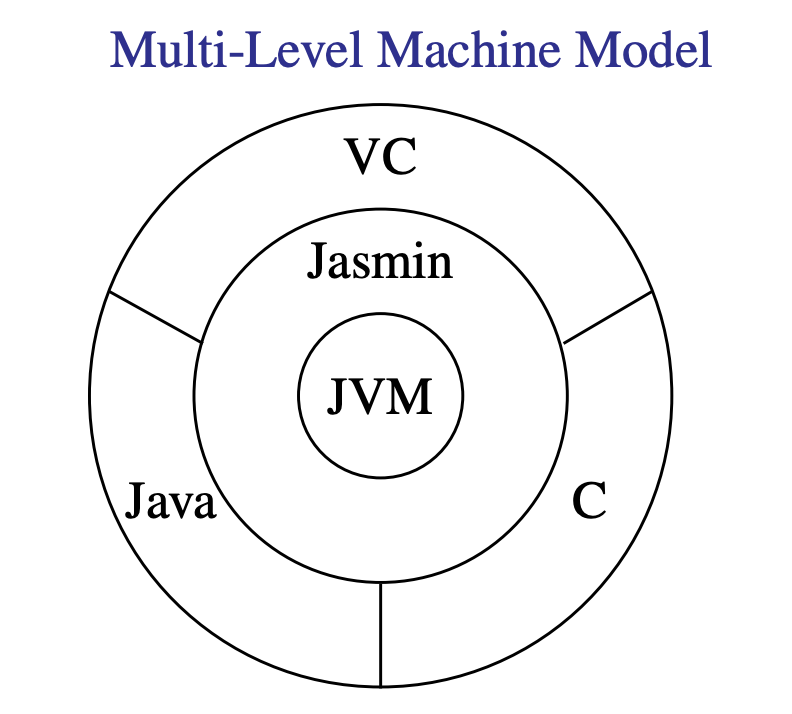
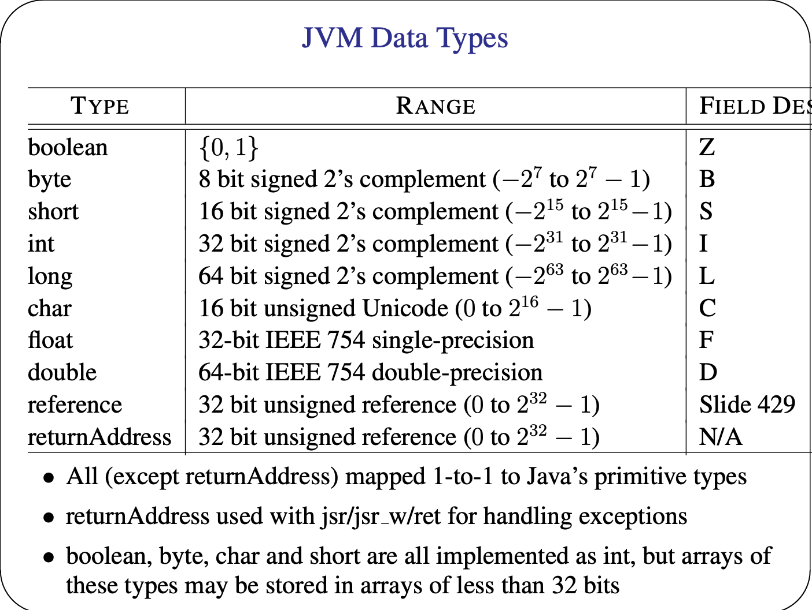

# Jasmin Assembly Instructions and JVM

## Our code generation

### An Example

```java

void whileInt() {
    int i = 0; while (i < 100) {
        i++;
    }
}
```

is compiled to 

```
Method void whileInt()
    iconst_0
    istore_1    //i's index is 1
    goto 8
    incc 1 1    // i++
    iload_1
    bipush 100
    if_icmplt 5
    return
```

### Jasmin Assembly Language v.s Java Byte Code
* 1-to-1 correspondence
    * Operation codes (opcodes) represented by mnemonics
    * Name indices written in symbolic form
    * Local variables are encoded by indices (integers)
* Example
    * Jasmin `iload` is equivalent to `0x60` in Java Byte Code
    * Jasmin `bipush 20` is equivalent to `0x1614` in Byte Code

### Multi-Level Machine Model
* There is a virtual machine and a language at each level
* Each level builds on the functionality of the level below and provides the functionality to the level above



## JVM

### JVM Data Types

* All (except returnAddress) mapped 1-to-1 to Java's primitive types
* returnAddress used with jsr/jsr_w/ret for handling exceptions
* boolean, byte, char and short are all implemented as int, but arrays of these types may be stored in arrays of less than 32 bits
* class and interface names are qualified names with "." replaced by "/"
* The no. of "[" is equal to the no. of dimensions of the array
    * i.e. `float[][]` has the type ``[[F``


### Method Descriptors
* (ParameterType*) Return Type
    * `int gcd(int i, int j)` is `(II) I`
    * `void main(String argv[])` is `([Ljava/lang/String;)V`
    * `char foo(float f String)` is `(FLjava/lang/String;)C`

### Operand Stack
* Accessed by pushing and popping values
    * Storing operands and receiving the operations' results
    * passing arguments and receiving method results
    * This unified view is one of the main reason why code generation for stack-based machines is easier than register-based machines
* A new operation stack is created every time a method is called
* An integral expression:
$$1 + 2 * 3 + 4$$
* Is translated to the Jasmin Code
``` iconst_1
    iconst_2
    iconst_3
    imul
    iadd
    iconst_4
    iadd
```

### Local Variable Array
* A new local variable array is created each time a method is called
* Local variables addressed by indexing, starting from 0
* Instance Methods:
    * slot 0 given to this
    * Parameters (if any) given consecutive indices, starting from 1
    * The indices allocated to the other variables are given in any order
* Class Methods:
    * Parameters (if any) given consecutive indices, starting from 0
    * The indices allocated to the other variables in any order
* One slot can hold a value of boolean, byte, char, short, int, float, reference and returnAddress
* One pair of slots can hold a value of long and double

Class Method:
```java
public static void foo() {
    int i1 = 1;
    int i2 = 2;
    int i3 = 3;
    int i = i1 + i2 * i3;
}
```

Jasmin Code:
```
    iconst_1
    istore_0
    iconst_2
    istore_1
    iconst_3
    istore_2
    iload_0
    iload_1
    iload_2
    imul
    iadd
    istore_3
```

Instance Method:
```java
public void foo() {
    int i1 = 1;
    int i2 = 2;
    int i3 = 3;
    int i = i1 + i2 * i3;
}
```

Jasmin Code:
```
    iconst_1
    istore_1
    iconst_2
    istore_2
    iconst_3
    istore_3
    iload_1
    iload_2
    iload_3
    imul
    iadd
    istore_4
```

Indices shifted by 1 as index 0 is reserved for `this`